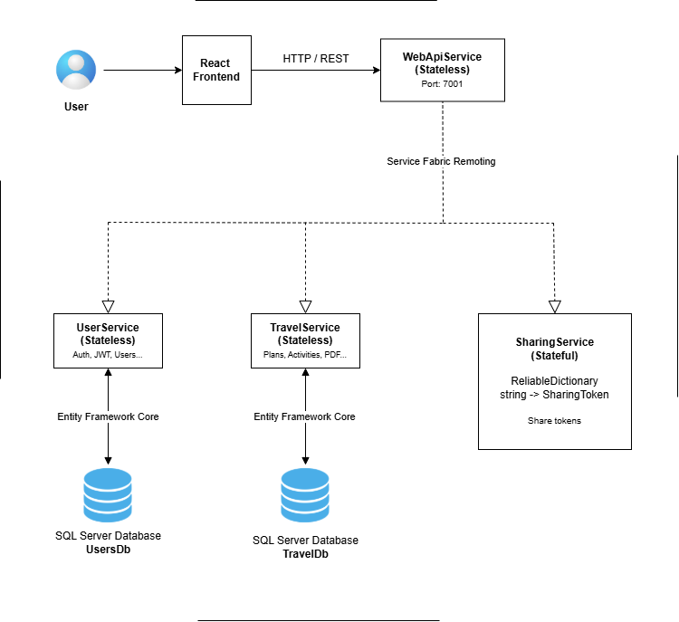

# Travel Planner Web Application

Web aplikacija za planiranje putovanja, koja omogućava korisniku da sve bitno za neko putovanje ima na jednom mestu:
destinacije, aktivnosti, budžet, checklist kao i deljenje plana putovanja preko QR koda.

Tehnologije:
- Frontend: React
- Backend: .NET + Microsoft Service Fabric
- Baza podataka: Microsoft SQL Server
- ORM: Entity Framework Core

## Arhitektura sistema

## Use case dijagram

## Podešavanje baze podataka

1. Otvoriti SQL Server Management Studio (SSMS)
2. Kreirati prazne baze podataka pod nazivom:

    UsersDb
    TravelDb

3. U fajlu appsettings.json (u backend projektima UserService i Travel Service + Ruta: PackageRoot/Config/)
   podesiti konekcioni string:
   
   UserService - appsettings.json:
   {
    "JwtSettings": {
        "Secret": "your-very-strong-secret-key-min-32-characters-long!",
        "Issuer": "TravelPlannerApp",
        "Audience": "TravelPlannerApp",
        "ExpirationMinutes": 15
    },

     "ConnectionStrings": {
        "DefaultConnection": "Server=.\\SQLEXPRESS;Database=UsersDb;Trusted_Connection=True;TrustServerCertificate=True"
     }
    }

    TravelService - appsettings.json:
    {
     "ConnectionStrings": {
        "DefaultConnection": "Server=.\\SQLEXPRESS;Database=TravelDb;Trusted_Connection=True;TrustServerCertificate=True"
     }
    }

4. Otvoriti Visual Studio

5. Otvoriti Package Manager Console:
   Tools → NuGet Package Manager → Package Manager Console

6. Izvršiti komande:
   
   Update-Database -Project UserService -StartupProject UserService
   Update-Database -Project TravelService -StartupProject TravelService

Ova komanda će automatski kreirati sve potrebne tabele koristeći postojeće migracije.

## WebApiService

1. I u ovom projektu unutar Config foldera treba napraviti appsettings.json, koji ima ovaj sadržaj:
{
  "Logging": {
    "LogLevel": {
      "Default": "Information",
      "Microsoft.AspNetCore": "Warning"
    }
  },

  "AllowedHosts": "*",

  "ConnectionStrings": {
    "TravelDb": "Server=localhost;Database=TravelDB;Trusted_Connection=True;TrustServerCertificate=True;",
    "UsersDb": "Server=localhost;Database=UsersDB;Trusted_Connection=True;TrustServerCertificate=True;"
  },

  "JwtSettings": {
    "Secret": "your-very-strong-secret-key-min-32-characters-long!",
    "Issuer": "TravelPlannerApp",
    "Audience": "TravelPlannerApp",
    "ExpirationMinutes": 15
  },
}

## Pokretanje backend-a

1. Otvoriti rešenje u Visual Studio
2. Postaviti Service Fabric projekat kao Startup Project
3. Kliknuti Run

Backend će biti dostupan na:
https://localhost:7001

## Pokretanje frontend aplikacije

1. Otvoriti terminal
2. Ući u frontend folder:

   cd travel-planner-app/client

3. Instalirati dependencies:

   npm install

4. Kreirati .env sa sadrzajem:

   VITE_API_URL=http://localhost:7001/api

5. Pokrenuti aplikaciju:

   npm run dev