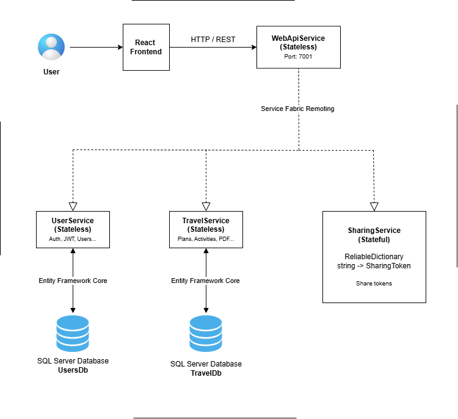

# Travel Planner Web Application

Web aplikacija za planiranje putovanja, koja omogućava korisniku da sve bitno za neko putovanje ima na jednom mestu:
destinacije, aktivnosti, budžet, checklist kao i deljenje plana putovanja preko QR koda.

Tehnologije:
- Frontend: React
- Backend: .NET + Microsoft Service Fabric
- Baza podataka: Microsoft SQL Server
- ORM: Entity Framework Core

## Arhitektura sistema



## Use case dijagram


## Podešavanje baze podataka

1. Otvoriti SQL Server Management Studio (SSMS)
2. Kreirati prazne baze podataka pod nazivom:

    UsersDb
    TravelDb

3. U fajlu appsettings.json (u backend projektima UserService i Travel Service + Ruta: PackageRoot/Config/)
   podesiti konekcioni string:
   
   UserService - appsettings.json:
   {
    "JwtSettings": {
        "Secret": "your-very-strong-secret-key-min-32-characters-long!",
        "Issuer": "TravelPlannerApp",
        "Audience": "TravelPlannerApp",
        "ExpirationMinutes": 15
    },

     "ConnectionStrings": {
        "DefaultConnection": "Server=.\\SQLEXPRESS;Database=UsersDb;Trusted_Connection=True;TrustServerCertificate=True"
     }
    }

    TravelService - appsettings.json:
    {
     "ConnectionStrings": {
        "DefaultConnection": "Server=.\\SQLEXPRESS;Database=TravelDb;Trusted_Connection=True;TrustServerCertificate=True"
     }
    }

4. Otvoriti Visual Studio

5. Otvoriti Package Manager Console:
   Tools → NuGet Package Manager → Package Manager Console

6. Izvršiti komande:
   
   Update-Database -Project UserService -StartupProject UserService
   Update-Database -Project TravelService -StartupProject TravelService

Ova komanda će automatski kreirati sve potrebne tabele koristeći postojeće migracije.

## WebApiService

1. I u ovom projektu unutar Config foldera treba napraviti appsettings.json, koji ima ovaj sadržaj:
{
  "Logging": {
    "LogLevel": {
      "Default": "Information",
      "Microsoft.AspNetCore": "Warning"
    }
  },

  "AllowedHosts": "*",

  "ConnectionStrings": {
    "TravelDb": "Server=localhost;Database=TravelDB;Trusted_Connection=True;TrustServerCertificate=True;",
    "UsersDb": "Server=localhost;Database=UsersDB;Trusted_Connection=True;TrustServerCertificate=True;"
  },

  "JwtSettings": {
    "Secret": "your-very-strong-secret-key-min-32-characters-long!",
    "Issuer": "TravelPlannerApp",
    "Audience": "TravelPlannerApp",
    "ExpirationMinutes": 15
  },
}

## Pokretanje backend-a

1. Otvoriti rešenje u Visual Studio
2. Postaviti Service Fabric projekat kao Startup Project
3. Kliknuti Run

Backend će biti dostupan na:
https://localhost:7001

## Pokretanje frontend aplikacije

1. Otvoriti terminal
2. Ući u frontend folder:

   cd travel-planner-app/client

3. Instalirati dependencies:

   npm install

4. Kreirati .env sa sadrzajem:

   VITE_API_URL=http://localhost:7001/api

5. Pokrenuti aplikaciju:

   npm run dev

## Observability - Application Metrics, Distributed Tracing + Grafana

Deo diplomskog rada (Tema 9 - Implementacija observabilnosti mikroservisne arhitekture).
Detaljno objašnjenje distribuiranog tracinga (kako radi, kako se testira i kako se
otklanjaju problemi) nalazi se u [observability/DISTRIBUTED-TRACING.md](observability/DISTRIBUTED-TRACING.md).

### Application Metrics

Svaki servis (WebApiService, UserService, TravelService, SharingService) koristi
OpenTelemetry SDK da prikuplja application metrics i izlaze ih u Prometheus formatu na
`/metrics` endpointu (isti port kao `/health`):

| Servis         | Port | Metrics endpoint                  | Tip metrika |
|----------------|------|------------------------------------|-------------|
| WebApiService   | 7001 | http://localhost:7001/metrics      | HTTP RED metrike (broj zahteva, trajanje, statusi) preko ASP.NET Core instrumentacije + .NET runtime metrike |
| UserService     | 7011 | http://localhost:7011/metrics      | Custom business metrike (Register/Login/Update/Delete...) + .NET runtime metrike |
| TravelService    | 7012 | http://localhost:7012/metrics      | Custom business metrike po entitetu (TravelPlan/Activity/Checklist/Expense/Destination) + .NET runtime metrike |
| SharingService  | 7013 | http://localhost:7013/metrics      | Custom business metrike (kreiranje/pristup/opoziv deljenih linkova) + .NET runtime metrike |

### Distributed Tracing

Svaki HTTP zahtev koji stigne na WebApiService dobija jedinstven `trace-id`, koji se
zatim prenosi kroz Service Fabric Remoting pozive do UserService/TravelService/
SharingService i dalje do SQL upita. Rezultat je jedan povezan trace po korisnickom
zahtevu, umesto cetiri nepovezana zapisa.

Posto Service Fabric Remoting nije HTTP, standardna OpenTelemetry instrumentacija ne
moze da ubaci `traceparent` zaglavlje. Zato se koristi paket
`OpenTelemetry.Instrumentation.ServiceFabricRemoting`, koji zamenjuje podrazumevani
remoting provider verzijom sto trace context upisuje u zaglavlja remoting poruke na
klijentu i cita ih na serveru.

| Komponenta | Uloga u tracingu |
|------------|------------------|
| WebApiService | Root span (ASP.NET Core instrumentacija) + klijentski span-ovi za remoting pozive |
| UserService / TravelService | Server-side remoting span-ovi + SQL span-ovi (EF Core preko SqlClient instrumentacije) |
| SharingService | Server-side remoting span-ovi (Reliable Collections, bez SQL-a) |
| Jaeger | Prijem span-ova preko OTLP (port 4317), skladistenje i pretraga |
| Grafana | Objedinjeni prikaz: trace-ovi iz Jaeger-a + metrike iz Prometheus-a |

Servisi ostaju na Service Fabric-u (bez dockerizacije), u skladu sa preporukom mentora.
Dockerizovani su samo alati za observability (Prometheus, Jaeger i Grafana). Bitna
razlika u smeru komunikacije: **metrike Prometheus povlaci** sa `/metrics` endpointa,
dok **trace-ove servisi guraju** ka Jaeger-u na `localhost:4317`.

### Pokretanje

1. Proveriti da Docker Desktop radi.
2. Otvoriti terminal u `observability` folderu i pokrenuti:

   ```
   cd observability
   docker compose up -d
   ```

   Ovo se radi **pre** pokretanja servisa: OTLP exporter tiho odustaje ako Jaeger nije
   dostupan, pa bi se span-ovi iz prvih zahteva izgubili.

3. Pokrenuti TravelPlannerApp Service Fabric aplikaciju iz Visual Studio (F5).

4. Prometheus (provera da li su svi servisi "up" - Status → Targets):

   http://localhost:9090/targets

5. Jaeger UI (pretraga trace-ova po servisu, operaciji i trajanju):

   http://localhost:16686

6. Grafana (korisnik: `admin`, lozinka: `admin`):

   http://localhost:3001

   Dva dashboard-a se automatski ucitavaju (provisioning) u folderu **TravelPlannerApp**:

   - **TravelPlannerApp - Application Metrics**
     - HTTP request rate, p95 trajanje i stopu gresaka za WebApiService (gateway)
     - business metrike po servisu (broj operacija, ishod, trajanje - npr. broj
       registracija/prijava, kreiranih putovanja, deljenih linkova...)
     - .NET runtime metrike (GC heap size, thread pool) po servisu
   - **TravelPlannerApp - Distributed Tracing**
     - tabela poslednjih trace-ova i tabela sporih trace-ova (klik na `traceID`
       otvara vremensku osu celog zahteva)
     - iste RED metrike pored njih, radi korelacije pojedinacnog slucaja sa
       agregatnom slikom

7. Da bi se videli podaci, potrebno je koristiti aplikaciju (frontend ili Swagger na
   https://localhost:7001/swagger) - i metrike i trace-ovi se pune stvarnim
   saobracajem kroz servise.

### Zaustavljanje

```
cd observability
docker compose down
```

(Servisi na Service Fabric-u se zaustavljaju kao i obicno, iz Visual Studio ili
Service Fabric Explorer-a.)

### Troubleshooting

- Ako Prometheus (http://localhost:9090/targets) prikazuje neki od servisa kao "down":
  proveriti da je Service Fabric aplikacija zaista pokrenuta (Service Fabric Explorer -
  http://localhost:19080) i da odgovarajuci port (7001/7011/7012/7013) radi lokalno
  (npr. otvoriti http://localhost:7011/health u browseru).
- Windows Firewall prilikom prvog pokretanja moze da zatrazi dozvolu za Kestrel/dotnet
  proces da prima konekcije - potrebno je dozvoliti (Allow access), inace `host.docker.internal`
  iz Docker kontejnera nece moci da dopre do servisa.
- `host.docker.internal` radi automatski na Docker Desktop-u za Windows/Mac; ako se
  observability stack pokrece na Linuxu, potrebno je u `docker-compose.yml` dodati
  `extra_hosts: ["host.docker.internal:host-gateway"]` za prometheus servis.
- Ako u Jaeger UI-u nema nijednog servisa u padajucoj listi: proveriti da je Jaeger
  pokrenut **pre** Service Fabric aplikacije i da port 4317 nije zauzet
  (`netstat -ano | findstr 4317`). Detaljno u
  [observability/DISTRIBUTED-TRACING.md](observability/DISTRIBUTED-TRACING.md).